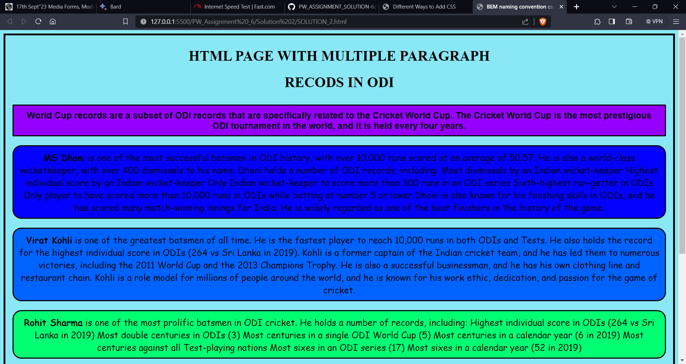

 # SOLUTION 2 
 ### explain how you've named the classes.

 **I've name the classes using BEM naming convention .cricket**
 ### 1__The block follows the naming convention in CSS as .cricket__

 ### 2__ The Elements follow the naming convention mentioned as: .block__element___

 ### 3__ The Elements follow the naming convention mentioned as: .block__element ___

 # OUTPUT IMAGE
 